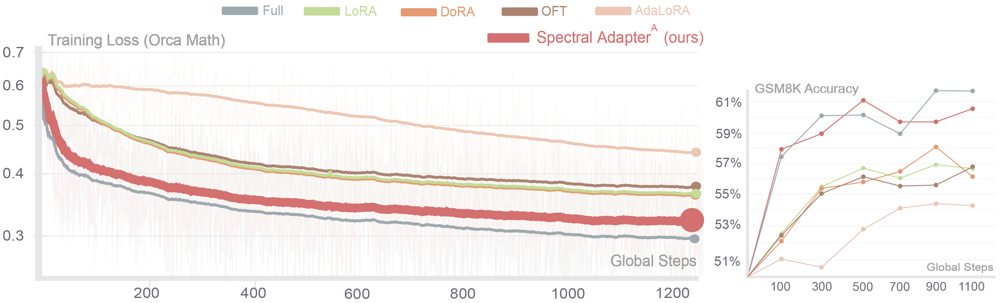
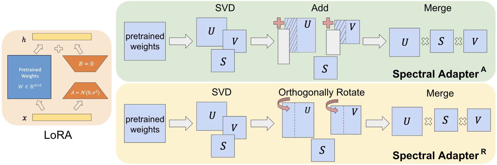

# Spectral Adapter: Fine-Tuning in Spectral Space

This repo contains the source code for experiments for our paper

**Spectral Adapter: Fine-Tuning in Spectral Space**  
*Fangzhao Zhang, Mert Pilanci*  
Paper: [https://arxiv.org/abs/2405.13952](https://arxiv.org/abs/2405.13952)  

Recent developments in Parameter-Efficient Fine-Tuning (PEFT) methods for pretrained deep neural networks have captured widespread interest. In this work, we study the enhancement of current PEFT methods by incorporating the spectral information of pretrained weight matrices into the fine-tuning procedure. We investigate two spectral adaptation mechanisms, namely additive tuning and orthogonal rotation of the top singular vectors, both are done via first carrying out Singular Value Decomposition (SVD) of pretrained weights and then fine-tuning the top spectral space. 

The following plots show the superiority of our spectral adapter applied to fine-tune llama3 8B model

 

## Method Overview
In this project, we investigate the performance of fine-tuning the spectral space of pretrained model weights. The following figure demonstrates our method. Specifically, we consider both addtive fine-tuning and (orthogonal) rotational fine-tuning of top singular vectors. For orthogonal rotation implementation, we employ cayley parameterization.

 

## Repository Overview
In this project, we experiments with language model fine-tuning and diffusion model fine-tuning.
1. LLama3-8B Fine-Tuning (see [llama3_tune/](llama3_tune) for experiment code.)
2. DeBERTaV3-base Fine-Tuning (see [deberta_tune/](deberta_tune) for experiment code.)
3. Mistral 7B Fine-Tuning (see [mistral_tune/](mistral_tune) for experiment code.)
