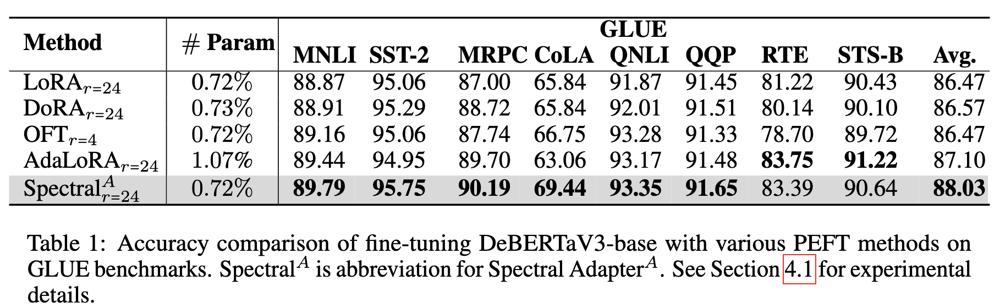

# Deberta Experiments for Spectral Adapter


**Spectral Adapter: Fine-Tuning in Spectral Space** <br>
*Fangzhao Zhang, Mert Pilanci* <br>
Paper: [https://arxiv.org/abs/2405.13952](https://arxiv.org/abs/2405.13952) <br>

This repository is for reproducing Table 1 result:
<p>

</p>

## Quickstart
Clone the repo and run the following command
 ```
 cd deberta_tune
 conda create -n deberta_tune python=3.12
 conda activate deberta_tune
 conda install pytorch torchvision torchaudio pytorch-cuda=11.8 -c pytorch -c nvidia
 pip install -r requirements.txt
 ```

## Our Method
Run the following command, <code>cola,mnli,mrpc,qnli,qqp,rte,stsb,sst2</code> are all valid choices for <code>--task</code>.
```
cd spectral_lora_tune
CUDA_VISIBLE_DEVICES=0 python glue_tune.py --model=spectral --task=cola
```
Only support single GPU usage.

## Baselines
for ``lora``:
```
cd spectral_lora_tune
CUDA_VISIBLE_DEVICES=0 python glue_tune.py --model=lora --task=cola
```
for ``dora``:
```
cd dora_tune
CUDA_VISIBLE_DEVICES=0 python glue_tune.py --task=cola
```
for ``adalora``:
```
cd adalora_tune
CUDA_VISIBLE_DEVICES=0 python glue_tune.py --task=cola
```
for ``oft``:
```
cd oft_tune
CUDA_VISIBLE_DEVICES=0 python glue_tune.py --task=cola
```

