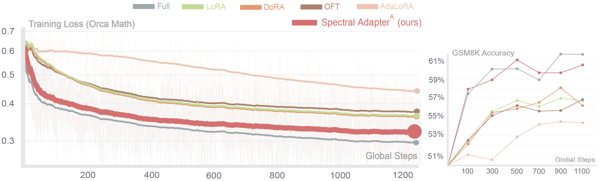

# Llama3 Experiments for Spectral Adapter


**Spectral Adapter: Fine-Tuning in Spectral Space** <br>
*Fangzhao Zhang, Mert Pilanci* <br>
Paper: [https://arxiv.org/abs/2405.13952](https://arxiv.org/abs/2405.13952) <br>

This repository is for reproducing Figure 1 result:
<p>

</p>

## Quickstart
Clone the repo and run the following command
 ```
 cd llama3_tune
 pip install -r requirements.txt
 cd lm-evaluation-harness
 pip install -e .
 cd ..
 ```

## Training 
Run the following command, can replace <code>spectral</code> with <code>full,lora</code> for baselines.
```
python llama_tune.py --model=spectral
```

## Testing
Run the following command, can replace <code>spectral</code> with <code>full,lora</code> for baselines. Defaultly, checkpoint is saved for <code>100,300,500,700,900,1100</code>.
```
python llama_test.py --model=spectral --checkpoint=100
```
we report the 5-shot flexible-extract exact_match score. 
