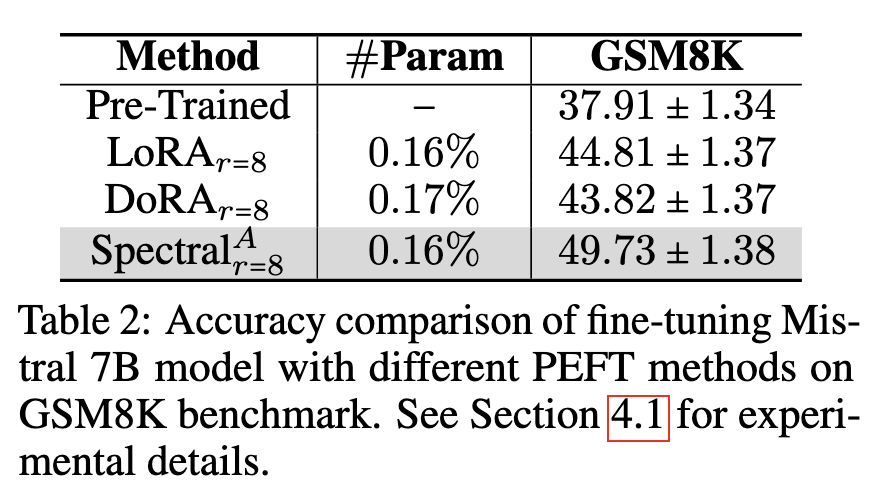

# Mistral Experiments for Spectral Adapter


**Spectral Adapter: Fine-Tuning in Spectral Space** <br>
*Fangzhao Zhang, Mert Pilanci* <br>
Paper: [https://arxiv.org/abs/2405.13952](https://arxiv.org/abs/2405.13952) <br>

This repository is for reproducing Table 2 result:
<p>

</p>

## Quickstart
Clone the repo and run the following command
 ```
 cd mistral_tune
 conda create -n mistral_tune python=3.12.7
 conda activate mistral_tune
 conda install pytorch==2.4.1 torchvision torchaudio pytorch-cuda=11.8 -c pytorch -c nvidia
 pip install -r requirements.txt
 cd lm-evaluation-harness
 pip install -e .
 cd ..
 ```

## Our Method
### Train
```
cd spectral_lora_tune
CUDA_VISIBLE_DEVICES=0 python mistral_tune.py --model=spectral
```
### Test
```
cd spectral_lora_tune
python mistral_test.py --model=spectral
```
## Baselines
LoRA:
```
cd spectral_lora_tune
CUDA_VISIBLE_DEVICES=0 python mistral_tune.py --model=lora
python mistral_test.py --model=lora
```
DoRA:
```
cd dora_tune
CUDA_VISIBLE_DEVICES=0 python mistral_tune.py
python mistral_test.py
```
Original:
```
cd spectral_lora_tune
python mistral_test.py --model=original
```
## Metric
We report GSM8K (strict-match,5-shot,exact_match) score.
